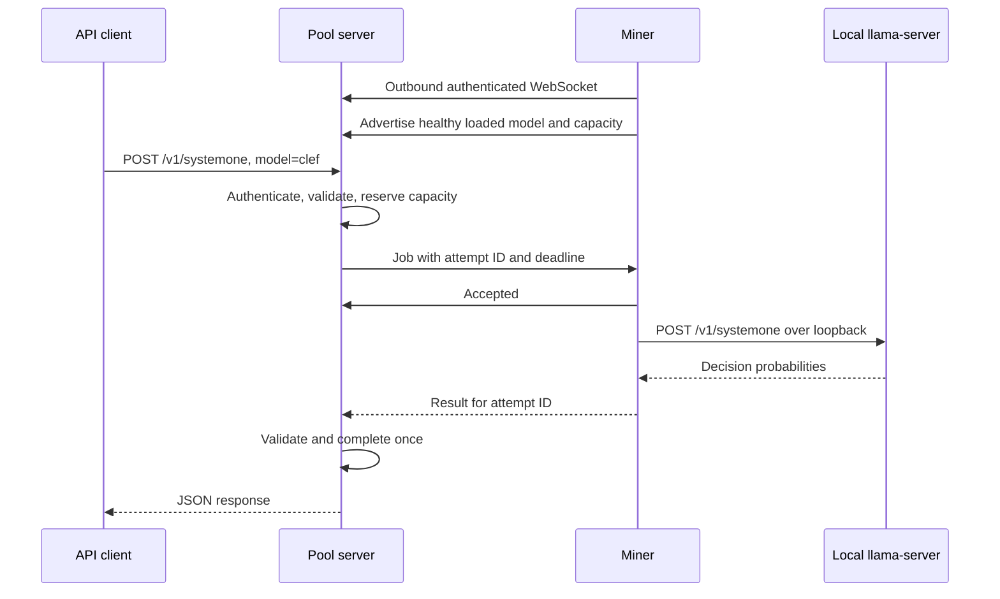

# ai-pool — architecture and implementation plan

> **Status: draft.** Open decisions are listed in §12 and need answers before implementation starts.
> This plan was drafted with an architecture planning agent after reading the Clef runtime in `refactor-tool/crates/cleff`.
Recommended MVP: one Rust pool server, Rust miners connecting outbound over WebSocket, a JSON model catalog, and Clef inference through a managed, pinned `llama-server`. Start with trusted or approved miners, one concurrent inference per GPU, bounded queues, and no database or payments.


**1. Verified facts and implementation implications**

Sources: `refactor-tool/crates/cleff` (README, lib.rs, engine.rs, question.rs, cache.rs, child.rs, config.rs, build.rs) and upstream llama.cpp.

Two findings affect the design:

- **Compatible upstream binaries exist.** llama.cpp release **`b11374`** points to **`b92761a`** and lists macOS Apple Silicon, Linux x64 CUDA, and Windows x64 CUDA binaries, plus separate CUDA runtime libraries. Miners therefore have a plausible installation path without CMake or a CUDA compiler toolkit. I verified the release listing, but did not download archives, verify their hashes, inspect their dependencies, or execute them. Those remain release gates. [Upstream release](https://github.com/ggml-org/llama.cpp/releases/tag/b11374)
- **System One and Clef are upstream features.** Clef support merged into `master` on October 3, 2026. The pinned server documents `/v1/systemone`, including Clef’s joint evaluation of questions and non-streaming responses. [Clef merge](https://github.com/ggml-org/llama.cpp/pull/29831), [pinned API documentation](https://raw.githubusercontent.com/ggml-org/llama.cpp/b92761a515ea31e852e7fbc1fad5f874b46f3718/tools/server/README.md)

There is also a local documentation discrepancy: the current `refactor-tool/crates/cleff/src/engine.rs:87` sets **`-c`, `-b`, and `-ub` to `config.context_size`**, and validates returned tokens against that context. It no longer uses fixed 8192 batches or `min(ctx, 8192)`, although the README still describes those limits. The configured default remains 16384.

For ai-pool, explicitly pin the runtime **and its context/batch profile**. I recommend a more conservative initial **4096-token profile**, subject to GPU measurements before release.

Do not directly depend on the sibling `cleff` crate: its build script unconditionally builds CUDA llama.cpp, and its API includes unrelated Jev behavior. Reuse its download, validation, and child-process patterns in a portable runtime crate, preserving relevant notices.

**2. Components, workspace, and data flow**

Use a Cargo workspace:

```text
Cargo.toml                     # default-members = ["crates/pool-server"]
crates/
  pool-protocol/               # Catalog, WS messages, IDs, errors, validation
  pool-server/                 # axum API, auth, scheduler, miner registry
  pool-miner/                  # clap CLI, hardware discovery, connection loop
  pool-runtime/                # Downloads, runtime installation, child management
config/
  models.json                 # Working default catalog
  models.example.json         # Same usable defaults, documented separately
  models.schema.json          # JSON Schema generated from catalog types
  server.example.toml
runtime/
  manifest.json               # Release-maintained runtime assets and hashes
docs/
  quickstart.md
  protocol.md
  operations.md
```

Core dependencies: Tokio, axum, serde/serde_json, reqwest with rustls, tokio-tungstenite, clap, tracing, sha2, and an OS cache-directory helper.

The server has no GPU dependency. The miner supervises one local runtime process per resident model. A model being downloaded or merely cached is never advertised as ready.



Keep scheduling state in one Tokio task receiving commands over bounded channels. This makes slot reservation, disconnect handling, cancellation, and completion atomic without a web of shared locks.

The miner’s connection and heartbeat tasks must remain responsive while inference, downloads, and checksum verification run.

**3. Client API**

**Choose capability-specific endpoints with a required model name.** For the MVP, expose System One directly. Later, add `/v1/chat/completions` for actual chat models.

This preserves Clef’s native semantics and leaves a clear expansion path. An arbitrary HTTP passthrough would expose unnecessary runtime routes and make validation and security harder.

| Endpoint | Purpose |
|---|---|
| `GET /healthz` | Pool process is alive |
| `GET /readyz` | Catalog and scheduler initialized |
| `GET /v1/models` | Catalog summaries and live availability |
| `GET /v1/models/{id}` | Model description, capabilities, limits, availability |
| `POST /v1/systemone` | Clef decision inference |
| `GET /miner/v1/catalog` | Authenticated catalog with download descriptors |
| `GET /miner/v1/connect` | Authenticated WebSocket upgrade |

`readyz` need not require a miner: the pool can be operational while a model is unavailable. Model availability belongs in the model-list response.

Example model list:

```json
{
  "object": "list",
  "catalog_revision": "sha256:<computed-catalog-digest>",
  "data": [
    {
      "id": "clef",
      "object": "model",
      "description": "Clef-Flash Q8_0 decision model",
      "capabilities": ["systemone"],
      "streaming": false,
      "max_context_tokens": 4096,
      "availability": {
        "ready_miners": 1,
        "free_slots": 1,
        "queued_requests": 0
      }
    }
  ]
}
```

The catalog remains visible when no miners are connected. Availability is a snapshot, not a reservation.

Example request:

```http
POST /v1/systemone
Authorization: Bearer [REDACTED]
Content-Type: application/json
```

```json
{
  "model": "clef",
  "state": {
    "message": "I was charged twice."
  },
  "questions": {
    "refund": {
      "type": "noul",
      "instructions": "Is the customer reporting a billing problem?"
    },
    "route": {
      "type": "choice",
      "instructions": "Which team should handle this?",
      "criteria": {
        "billing": "Payment and billing problems",
        "technical": "Product faults"
      }
    }
  }
}
```

The pool removes its routing field before forwarding the native body. It must preserve the joint request: splitting questions into separate jobs can change Clef’s answers.

Illustrative response:

```json
{
  "model": "clef",
  "answers": {
    "refund": {
      "type": "noul",
      "noul": 0.98
    },
    "route": {
      "type": "choice",
      "choice": "billing",
      "probabilities": {
        "billing": 0.99,
        "technical": 0.01
      },
      "confidence": 0.98
    }
  },
  "usage": {
    "input_tokens": 112,
    "output_tokens": 0
  }
}
```

Preserve native answer fields. Return pool-generated `X-Request-ID` and `X-Model-Revision` headers. Do not reinterpret the upstream `confidence` field using Cleff’s separate convenience-API definition.

MVP validation policy:

- Required explicit `model`; the catalog default only preselects the miner’s model.
- Text/JSON state only; no image input.
- At most 16 questions; choice questions allow 2–16 options; scores allow 2–10 ordered levels.
- Request body limit: 1 MiB.
- No arbitrary URLs, file paths, runtime parameters, or executable tools.
- Full rendered input must fit the catalog context; never silently truncate.

The exact token count comes from the pinned runtime’s full prompt construction. Byte limits at the pool are an additional resource limit, not a substitute for token validation.

**Streaming:** Clef is non-streaming. Reject `stream: true` with `400 unsupported_streaming`. Later chat support can use SSE, with bounded chunk forwarding and cancellation. Once streaming begins, an interrupted request must not be transparently replayed.

**Errors**

Use a stable envelope:

```json
{
  "error": {
    "code": "no_miner_available",
    "message": "No healthy miner is serving clef.",
    "request_id": "req_...",
    "retryable": true
  }
}
```

| Situation | HTTP status / code |
|---|---|
| Missing or invalid client key | `401 unauthorized` |
| Valid key lacks access | `403 forbidden` |
| Unknown model | `404 model_not_found` |
| Invalid questions or unsupported capability | `400 invalid_request` |
| Input exceeds context | `400 context_length_exceeded` |
| Request exceeds byte limit | `413 payload_too_large` |
| Client rate or concurrency limit | `429 rate_limit_exceeded` |
| No healthy miner has the model loaded | `503 no_miner_available` |
| Pool queue is full | `503 pool_overloaded` |
| Queue deadline expires | `503 queue_timeout` |
| Overall request deadline expires | `504 inference_timeout` |
| Miner failure after retry is exhausted | `502 miner_failed` |
| Malformed miner result | `502 invalid_miner_result` |

Supply `Retry-After` for temporary capacity errors where useful. Sanitize runtime errors rather than returning raw stderr or local paths.

**4. Miner–pool protocol**

Use miner-initiated **WSS**, with WS allowed for local development. Miners require no inbound ports or NAT configuration.

Use JSON text messages and WebSocket subprotocol `ai-pool.v1`. Authenticate the upgrade with a bearer miner token, never a token in the URL.

**Registration**

```json
{
  "type": "hello",
  "protocol_version": 1,
  "miner_id": "persistent-installation-uuid",
  "miner_version": "0.1.0",
  "hardware": {
    "os": "linux",
    "arch": "x86_64",
    "accelerator": "cuda",
    "device_name": "NVIDIA GPU",
    "memory_total_bytes": 17179869184
  }
}
```

The pool returns a new session ID, server-instance ID, heartbeat interval, lease duration, and catalog revision. Bind authenticated identity to the token; the miner-provided UUID is only an installation label.

After loading and checking a runtime:

```json
{
  "type": "capacity",
  "sequence": 1,
  "total_slots": 1,
  "models": [
    {
      "model": "clef",
      "model_revision": "sha256:<resolved-model-descriptor>",
      "profile": "cuda-4096",
      "state": "ready",
      "max_context_tokens": 4096,
      "slots": 1
    }
  ]
}
```

`model_revision` binds weights, runtime commit, wire contract, and inference profile. Accept only catalog-approved combinations. Hardware descriptions and hashes reported by miners are claims, not attestations.

**Job dispatch**

```json
{
  "type": "job",
  "session_id": "session_...",
  "job_id": "job_...",
  "attempt_id": "attempt_...",
  "model": "clef",
  "model_revision": "sha256:<resolved-model-descriptor>",
  "operation": "systemone",
  "timeout_ms": 150000,
  "lease_ms": 30000,
  "payload": {
    "state": {"message": "I was charged twice."},
    "questions": {
      "q": {
        "type": "noul",
        "instructions": "Is this a billing problem?"
      }
    }
  }
}
```

Every attempt receives its own ID. The miner sends `accepted` within five seconds, or `rejected` with a structured reason such as `busy`, `model_unavailable`, or `revision_mismatch`.

Remaining message types:

| Message | Direction | Purpose |
|---|---|---|
| `heartbeat` | Miner → pool | Active attempt IDs and health |
| `heartbeat_ack` | Pool → miner | Renew leases for recognized attempts |
| `capacity` | Miner → pool | Loaded-model and capacity changes |
| `result` | Miner → pool | Completed native response |
| `job_error` | Miner → pool | Structured inference failure |
| `cancel` | Pool → miner | Client disconnected or deadline expired |
| `cancelled` | Miner → pool | Work stopped and capacity released |
| `draining` | Miner → pool | Stop assigning new jobs |
| `goodbye` | Either | Orderly connection shutdown |

Use ten-second heartbeats and thirty-second liveness/lease windows. A heartbeat must not extend the original request deadline.

**Cancellation and reconnection**

Cancellation must free actual runtime capacity, not just remove a pool bookkeeping entry. Initially, try aborting the local HTTP request. If the runtime keeps computing, mark the slot unavailable until completion; after a short grace period, kill and restart the dedicated child. Verify cancellation behavior during runtime qualification.

On connection loss, the miner stops accepting work and cancels orphaned attempts. Reconnect with exponential backoff and jitter, from one to thirty seconds. Reauthenticate and advertise a fresh snapshot under a new session ID.

Do not resume old attempts in the MVP. Late results from replaced sessions or attempts are discarded. A result/cancellation race is resolved once by the pool scheduler.

Use a 2 MiB WebSocket message limit and bounded outbound queues. Close slow or malformed connections.

**5. Scheduling, timeouts, and backpressure**

Route only to miners whose approved model revision is **loaded, healthy, and ready**.

Start with this policy:

1. Validate and authenticate before queue admission.
2. If no healthy miner serves that model, return `503` immediately.
3. Otherwise, dispatch to a free compatible slot or enter a bounded queue.
4. Choose among eligible miners by lowest assigned load, with round-robin tie-breaking.
5. Reserve capacity atomically before sending the job.

Recommended defaults:

| Setting | Default |
|---|---:|
| Concurrent inference per GPU | 1 |
| Runtime-local waiting queue | 0 |
| Pool queue per model | 32 |
| Pool queue globally | 64 |
| Active requests per client key | 2 |
| Queued requests per client key | 8 |
| Maximum queue wait | 15 seconds |
| Dispatch acknowledgement | 5 seconds |
| Maximum inference attempt | 150 seconds |
| Overall request deadline | 180 seconds |
| Retry on infrastructure failure | At most 1 |

All timers fit inside the original overall deadline. A retry receives only the time remaining.

Keep waiting work at the pool; hidden miner queues make load balancing and cancellation unreliable. Honor both per-model capacity and a miner/device-wide capacity limit so several loaded models cannot each consume the same GPU slot.

Use round-robin admission across client queues to prevent one client from monopolizing the model queue.

Retry once on another eligible miner for a disconnect, child crash, or clearly transient infrastructure error. Do not retry invalid requests or context violations. OOM removes the affected model from service until recovery; do not repeatedly dispatch the same workload to the failing process.

Retries can cause duplicate physical computation during network partitions. The guarantee is **at most one accepted client response**, not exactly-once execution. The MVP has no billable accounting that depends on exactly-once execution.

When the client disconnects, remove queued work or cancel its active attempt. Retain capacity reservations until the runtime actually stops, or the miner/session is removed.

**6. Model catalog**

Use `config/models.json`. It is the authoritative host-maintained catalog, with `.env` reserved for optional operational settings and secrets.

The schema should be versioned and generated from Rust types into JSON Schema. Reject unknown fields so misspelled configuration does not silently change behavior.

Concrete proposed default:

```json
{
  "$schema": "./models.schema.json",
  "schema_version": 1,
  "default_model": "clef",
  "models": [
    {
      "api_name": "clef",
      "description": "Clef-Flash Q8_0: text and JSON decision inference with probabilities.",
      "capabilities": ["systemone"],
      "streaming": false,
      "weights": [
        {
          "filename": "Clef-Flash-Q8_0.gguf",
          "urls": [
            "https://huggingface.co/ggml-org/Clef-Flash-GGUF/resolve/main/Clef-Flash-Q8_0.gguf"
          ],
          "sha256": "8754b06f7d16d6d6ab63493b2ee385cc0ed6abde8c25c39298dc3e1eb05593d9",
          "size_bytes": 9657260096
        }
      ],
      "runtime": {
        "type": "llama-server-systemone",
        "source_commit": "b92761a515ea31e852e7fbc1fad5f874b46f3718",
        "release_tag": "b11374",
        "wire_contract": "systemone-v1"
      },
      "max_context_tokens": 4096,
      "limits": {
        "request_bytes": 1048576,
        "max_questions": 16,
        "max_choice_options": 16,
        "max_score_levels": 10
      },
      "variants": [
        {
          "id": "cuda-4096",
          "targets": [
            "x86_64-unknown-linux-gnu",
            "x86_64-pc-windows-msvc"
          ],
          "accelerator": "cuda",
          "runtime_bundle_family": "llama-b11374-cuda12",
          "memory": {
            "kind": "dedicated",
            "vram_required_bytes": 15032385536,
            "recommended_device_memory_bytes": 17179869184,
            "recommended_system_memory_bytes": 17179869184,
            "status": "estimate"
          },
          "inference": {
            "context_tokens": 4096,
            "batch_tokens": 4096,
            "microbatch_tokens": 4096,
            "gpu_layers": 99,
            "concurrency": 1
          }
        },
        {
          "id": "metal-4096",
          "targets": ["aarch64-apple-darwin"],
          "accelerator": "metal",
          "runtime_bundle_family": "llama-b11374-metal",
          "memory": {
            "kind": "unified",
            "vram_required_bytes": null,
            "unified_memory_budget_bytes": 15032385536,
            "recommended_system_memory_bytes": 25769803776,
            "status": "estimate"
          },
          "inference": {
            "context_tokens": 4096,
            "batch_tokens": 4096,
            "microbatch_tokens": 4096,
            "gpu_layers": 99,
            "concurrency": 1
          }
        }
      ]
    }
  ]
}
```

`runtime_bundle_family` is a proposed internal identifier, not an asserted upstream asset filename. The miner’s release-maintained manifest resolves it and the target platform to exact archive URLs, sizes, hashes, dependencies, and executable paths. Runtime executable trust must not come solely from whichever pool the user joins.

**Schema and validation rules**

| Field | Constraint |
|---|---|
| `schema_version` | Supported integer version |
| `api_name` | Unique, nonempty, restricted identifier |
| `weights` | Nonempty array; each file has HTTPS mirrors, positive size, 64 hexadecimal SHA-256 characters |
| `runtime.type` | Supported enum; never an arbitrary executable |
| `source_commit` | Full 40-character commit |
| `max_context_tokens` | Positive integer supported by every advertised default variant |
| `variants` | Unique IDs and supported target/backend combinations |
| `memory` | Tagged dedicated/unified union with applicable positive byte fields |
| `inference` | Valid context, batch, microbatch, and concurrency combination |
| `default_model` | References an existing entry |

For this backend, require the full input to fit the configured context and microbatch. Set context, batch, and microbatch equal in the initial profiles.

**What “VRAM requirement with already-calculated maximum context” means**

A requirement must describe a complete profile:

> These weights, this runtime/backend, this context, these batch settings, and this concurrency require this memory budget.

Do not estimate supported context from weight-file size at miner startup. Publish explicit profiles that have been measured before release. Larger profiles can be added later with their own memory requirements.

The Q8_0 file is approximately **8.99 GiB**. My planning estimate is **roughly 12–16 GiB of accelerator memory at 4096 context and concurrency one**. The example reserves **14 GiB available**, targeting a 16 GiB NVIDIA card. This is an estimate, not a measured compatibility guarantee: non-causal attention and backend scratch allocations can be substantial.

For Apple Silicon, recommend **24 GiB total unified memory**, with approximately 14 GiB available to the workload and headroom for macOS and other applications. Unified memory must not be presented as dedicated VRAM.

Phase 0 must replace estimates with measured values or reduce the default context if necessary. A successful small request alone does not validate the maximum context.

**Loading and reload**

At startup, parse and validate the entire catalog before opening inference admission. Provide `pool-server check-config` for host validation without serving traffic.

For the MVP, **no hot reload**: restart the server after editing the catalog. This avoids changing model identities beneath active jobs. Later, add an explicit administrative reload that validates the whole replacement, swaps it atomically, and lets existing attempts finish against their original revision.

**7. Miner CLI and runtime lifecycle**

Suggested commands:

```sh
pool-miner --pool http://127.0.0.1:8080
pool-miner --pool http://127.0.0.1:8080 --models clef --yes
pool-miner list-models --pool https://pool.example
pool-miner download clef --pool https://pool.example
pool-miner doctor
pool-miner cache list
pool-miner cache verify clef
pool-miner cache remove clef
```

Useful flags:

```text
--pool
--models clef,another-model
--token-file
--device
--cache-dir
--runtime-path
--yes
--json
--shutdown-grace-seconds
```

Default invocation enters interactive selection in a terminal. Show model description, download size, context limit, memory estimate, compatibility, and cached status. Preselect Clef when it fits.

Without a terminal, require `--models`; do not hang awaiting input. Explicit `--models clef --yes` authorizes the download and startup.

**Hardware selection**

- NVIDIA on Linux and Windows: dynamically load NVML and inspect total/free memory, device UUID, and driver version. Fall back to `nvidia-smi` where necessary. NVML exposes total, free, and used device memory. [NVIDIA memory structure](https://docs.nvidia.com/deploy/nvml-api/latest/api/structnvmlMemory__t.html)
- Apple Silicon: inspect physical and available unified memory, Metal device availability, and its recommended working-set budget. Treat these as admission estimates and confirm by loading the runtime.
- Windows: handle NVML/reporting failures explicitly; “unknown” must not become zero or unlimited memory.
- Multiple GPUs: choose one explicitly in the MVP. Do not sum unrelated GPU memory or implement model sharding.
- Reject known insufficient capacity before downloading. Display uncertain fits as warnings requiring explicit selection.
- Multiple selected models may remain resident only if their aggregate memory budgets fit. Share a device-wide inference semaphore. No automatic model swapping in the MVP.

**Downloads and cache**

Use OS-standard cache locations under `ai-pool`, with content-addressed weight storage and separate runtime bundles.

Carry forward the good Cleff behavior:

- Exclusive download locks.
- Resumable `.part` files using validated HTTP Range responses.
- Restart safely when a server ignores Range.
- Bounded retries and disk-space checks.
- Exact size and SHA-256 verification.
- Atomic rename after verification.
- Full verification before model loading.
- Explicit cleanup; never evict an in-use model.

Show download, verification, loading, health-check, connected, busy, and draining states.

**Runtime installation**

On first use, select the approved platform bundle from the miner’s trusted manifest, download it with required shared libraries, verify every artifact, and extract safely. Reject archive path traversal and escaping symlinks.

Then:

1. Check runtime version and pinned commit.
2. Launch with the approved model/profile.
3. Bind only to `127.0.0.1`, using a private per-process API key where supported.
4. Poll `/health`.
5. Run a small System One capability probe.
6. Advertise ready capacity.

A proposed default launch is:

```text
llama-server -m <verified-model>
  -ngl 99 -c 4096 -b 4096 -ub 4096
  --host 127.0.0.1 --port <chosen-port>
```

Qualify any additional parallelism flags against the pinned binary. Retry boundedly on port-binding races.

`--runtime-path` is an advanced local override and must still pass compatibility checks. Normal users should not need a compiler toolkit; NVIDIA users still need a compatible driver.

**Shutdown**

Ctrl-C sends `draining`, stops accepting work, and allows up to thirty seconds for active inference. Then cancel remaining work, terminate and reap children, and close the socket.

Use Linux parent-death handling and Windows Job Objects. On macOS, add a supervisor/watchdog arrangement for abrupt miner death; ordinary Rust destructors alone do not guarantee child cleanup after a crash.

**8. Cross-platform distribution**

Use GitHub Actions for an explicit release matrix. Start with portable archives and small versioned install scripts; cargo-dist can automate the Rust packaging later if it simplifies the custom runtime bundles.

| Platform | Miner target | Runtime |
|---|---|---|
| Linux x86_64 | `x86_64-unknown-linux-gnu` | Pinned CUDA bundle |
| Windows x86_64 | `x86_64-pc-windows-msvc` | Pinned CUDA bundle and DLLs |
| macOS Apple Silicon | `aarch64-apple-darwin` | Pinned Metal bundle |
| macOS Intel | Defer miner support | CPU diagnostics only if desired |

Build the server for Linux amd64/arm64 and developer desktop platforms independently of GPU runtimes.

Release workflow:

1. Build Rust binaries with a committed lockfile.
2. Resolve the exact pinned upstream runtime archives.
3. Verify and record hashes, dependencies, minimum OS/driver requirements, and provenance.
4. Run real Clef inference on Linux NVIDIA, Windows NVIDIA, and Apple Silicon hardware.
5. Publish archives, checksums, and a signed runtime manifest.
6. Sign/notarize macOS distribution and sign Windows binaries where credentials are available.

Do not assume standard hosted CI runners provide useful GPU validation. Use controlled GPU runners or documented manual release qualification.

Provide user-local shell and PowerShell installers with version pinning and checksum verification. Do not install GPU drivers automatically.

If an upstream archive fails qualification, build the **same pinned commit in CI** with CUDA or Metal and publish an ai-pool runtime bundle. End users still receive binaries.

**9. Security and abuse**

Keep the first deployment restricted to trusted or individually approved miners.

- **Client authentication:** separate bearer API keys with model permissions, rate limits, and concurrency limits.
- **Miner authentication:** separately issued per-miner tokens, revocable independently. Client keys cannot register miners.
- **TLS:** HTTPS/WSS for remote operation; terminate at a reverse proxy if convenient.
- **Local defaults:** unauthenticated mode only under explicit local-development policy, bound to loopback. Production/proxy deployment must enable authentication; do not treat every loopback proxy connection as a trusted local client.
- **Input limits:** cap HTTP bodies, WS messages, question counts, queues, request duration, and miner connection counts.
- **Executable safety:** the pool cannot supply arbitrary shell commands, runtime URLs, arguments, or filesystem paths. Native model parsers remain an attack surface; run miners without elevated privileges.
- **Logging:** record IDs, durations, status, and capacity. Avoid logging evidence, answers, and tokens by default.
- **Local runtime isolation:** keep runtime HTTP private, bypass proxy environment variables for loopback requests, and sanitize inherited runtime settings.

**Result trust is the principal product risk.** A miner can fabricate valid-looking probabilities, report false hardware, or claim an approved model hash without running it. TLS and checksums do not prove honest inference.

The MVP can validate question IDs, answer shapes, finite probabilities, probability sums, token bounds, and the assigned attempt. Those checks detect malformed output, not convincing garbage.

Later, use hidden known-answer probes, sampled duplicate execution, reputation, and tolerance-based comparison against trusted workers. None provides a general cryptographic proof, and cross-platform numerical differences require tolerances.

Miners also see request plaintext. Public volunteer participation therefore changes the privacy promise of the service. Do not market it as confidential inference.

**10. Out-of-the-box defaults**

Ship the real catalog shown above and equivalent server defaults in code. `.env` is optional.

Proposed `server.example.toml`:

```toml
bind = "127.0.0.1:8080"
catalog = "config/models.json"
auth_mode = "local"

request_timeout_seconds = 180
queue_timeout_seconds = 15
inference_timeout_seconds = 150
dispatch_ack_timeout_seconds = 5

queue_capacity_global = 64
queue_capacity_per_model = 32
max_active_per_client = 2
max_queued_per_client = 8

heartbeat_seconds = 10
miner_liveness_seconds = 30
request_body_limit_bytes = 1048576
```

Set the workspace default member so the documented server command is simply:

```sh
cargo run
```

In another terminal:

```sh
cargo run -p pool-miner -- \
  --pool http://127.0.0.1:8080 \
  --models clef \
  --yes
```

Then:

```sh
curl http://127.0.0.1:8080/v1/models
```

```sh
curl http://127.0.0.1:8080/v1/systemone \
  -H 'Content-Type: application/json' \
  -d '{
    "model": "clef",
    "state": {"message": "Please refund the duplicate charge."},
    "questions": {
      "q": {
        "type": "noul",
        "instructions": "Is the customer requesting a refund?"
      }
    }
  }'
```

“Out of the box” means no configuration editing or native runtime compilation on supported hardware. It still requires the initial approximately 9.66 GB model download, sufficient memory, and a compatible GPU driver.

The runtime manifest must contain real verified artifacts before this quickstart is considered complete. Do not ship placeholder runtime URLs or checksums.

**11. Phased implementation**

| Phase | Concrete deliverables | Manual end-to-end acceptance |
|---|---|---|
| **0 — Qualify Clef runtime** | Exact runtime bundles and hashes; Linux/Windows CUDA and Mac Metal dependency checks; context/memory profiles; documented source/README discrepancy | On each supported GPU platform, run the pinned server, check health, submit `noul`, choice, and score requests; exercise near-limit and oversized input; measure peak memory; inspect cancellation and crash behavior |
| **1 — Local vertical slice** | Workspace, validated catalog, model list, miner CLI selection/download/cache, one WS miner, Clef adapter, request forwarding, structured errors | Start server and miner with the quickstart commands; obtain real probabilities; stop the miner and observe `503`; restart using verified cached weights |
| **2 — Robust pool MVP** | Multiple miners, atomic slot reservation, bounded queues, deadlines, retry, cancellation, reconnect, client keys, miner tokens, WSS deployment | Run two miners; submit overlapping requests; kill one during inference; observe bounded retry and one response; exceed queue limits; interrupt a client; verify capacity recovers |
| **3 — Portable release** | Qualified archives/installers for all three platforms, child cleanup, signed manifest, release CI, operational documentation | Install on clean supported machines without CMake/CUDA toolkit; join one pool; serve the same requests; resume an interrupted download; gracefully stop and verify GPU memory is released |
| **4 — Operations and model expansion** | Metrics, administrative status API, explicit catalog reload, optional server Docker image, additional backend adapters; chat/SSE if requested | Add another model, confirm capability-based routing, reload while requests run, test a slow/disconnected streaming client |
| **5 — Public participation, if wanted** | Enrollment/revocation, reputation, verification sampling, accounting persistence, rewards specification | Admit an intentionally faulty miner, verify quarantine/accounting behavior, and reconcile accepted work across reconnects and server restarts |

Phase 2 completes the functional pool MVP. Phase 3 completes the installable cross-platform MVP required by the project.

The runtime qualification phase comes first because unsupported binaries or incorrect memory assumptions would otherwise invalidate the entire quickstart.

**12. Decisions that need user input**

These are product choices rather than reasons to delay the architecture. Recommended defaults:

| Priority | Decision | Recommended default and reason |
|---|---|---|
| **1** | Owned/approved miners or anonymous volunteers? | **Owned or approved miners initially.** Public miners materially change result trust and data privacy. |
| **2** | What data may clients send to miners? | **Only data approved for disclosure to the operator’s miner fleet.** Arbitrary miners receive plaintext evidence. |
| **3** | Are payments or rewards required? | **No rewards in the MVP.** Add usage counters, but postpone billable accounting until verification and payout rules are defined. |
| **4** | Must the MVP support chat or other non-Clef models? | **Clef only**, with extensible capability/backend enums. Add chat endpoints when there is an actual second model requirement. |
| **5** | What hardware and context are mandatory? | **Initially target 16 GiB NVIDIA and 24 GiB Apple Silicon at 4096 context**, subject to Phase 0 measurements. Larger contexts need separate validated profiles. |
| **6** | How are clients and miners enrolled? | **Host-issued static client keys and individual miner tokens.** No account portal or self-service registration initially. |
| **7** | Is durable request history or accounting necessary? | **No database initially.** In-flight jobs fail on server restart; use structured operational logs. Introduce SQLite when durable keys, usage, or reputation are required. |
| **8** | Is Docker required for the server? | **Provide it after the native quickstart works.** The server is easy to containerize; native miners simplify GPU support across platforms. |
| **9** | Is an admin dashboard needed? | **Status API and CLI first.** Add a dashboard once the operational fields and workflows stabilize. |
| **10** | Are CPU, AMD, Intel Mac, or multi-GPU sharding required? | **Defer.** Qualify NVIDIA CUDA and Apple Silicon Metal first; keep runtime selection extensible. |