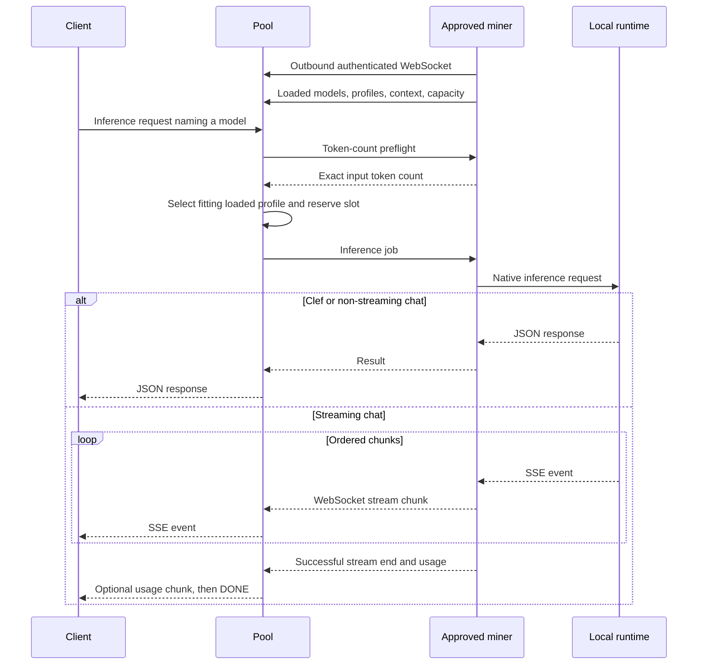

# ai-pool — architecture and implementation plan

> **Status: final. All decisions are recorded in §12.**
> Drafted with an architecture planning agent, then fact-checked: the HF weight hashes and revisions, the pinned llama.cpp routes, and local hardware.

The MVP serves **Clef decisions and GGUF chat models**, including OpenAI-compatible chat streaming. It uses one Rust pool server, Rust miners with outbound WebSocket connections, a JSON model catalog, and managed llama.cpp processes.

Miners are owned or approved machines authenticated with host-issued tokens. Results are trusted after shape and sanity validation. There are no rewards, accounting, database, public enrollment, or dashboard in the MVP.

**1. Verified runtime and default models**

**Shared runtime**

The pinned llama.cpp commit is:

```text
b92761a515ea31e852e7fbc1fad5f874b46f3718
```

It supports `/v1/systemone`, `/v1/chat/completions`, streaming chat, and `/v1/completions`. The pinned documentation describes both synchronous and streaming chat. I also inspected the local checkout at that exact commit: [route registration](https://github.com/ggml-org/llama.cpp/blob/b92761a515ea31e852e7fbc1fad5f874b46f3718/tools/server/server.cpp#L263) confirms the endpoints, and [stream serialization](https://github.com/ggml-org/llama.cpp/blob/b92761a515ea31e852e7fbc1fad5f874b46f3718/tools/server/server-task.cpp#L456) implements chat chunks and optional final usage. [Pinned upstream documentation](https://raw.githubusercontent.com/ggml-org/llama.cpp/b92761a515ea31e852e7fbc1fad5f874b46f3718/tools/server/README.md)

**Clef and supported chat models can share the same runtime installation for a given OS and accelerator.** Run separate processes with different weights and settings. A process loaded with Clef cannot answer chat requests merely because the executable implements that endpoint.

Upstream release **`b11374`** corresponds to the pin and lists macOS Apple Silicon, Linux CUDA, and Windows CUDA binaries, with separate CUDA libraries where applicable. Archive checksums, dependency packaging, and actual inference on each platform still require qualification. [Upstream release](https://github.com/ggml-org/llama.cpp/releases/tag/b11374)

**Clef**

Keep the supplied verified artifact:

| Field | Value |
|---|---|
| API name | `clef` |
| Repository | `ggml-org/Clef-Flash-GGUF` |
| File | `Clef-Flash-Q8_0.gguf` |
| Bytes | `9657260096` |
| SHA-256 | `8754b06f7d16d6d6ab63493b2ee385cc0ed6abde8c25c39298dc3e1eb05593d9` |
| HF revision | `4a7a08c09bc63baf043b62b5ba89dd67a0357d95` |
| Capability | `systemone` |

**Download from the pinned revision, not `main`.** On 2026-10-05 the HF repo re-uploaded every GGUF (`4a192915`): `Clef-Flash-Q8_0.gguf` on `main` is now 9,657,260,192 bytes with SHA-256 `d7c352faf1bdd9ea24d0b9347e8eb1eb4bbadeff6c02383bf750215a74f2f1f1`, and vision `mmproj` files were added. The file refactor-tool pins exists only at revision `4a7a08c09bc63baf043b62b5ba89dd67a0357d95`, so catalog URLs use `resolve/<revision>/`. Adopting the newer upload is a separate, qualified catalog change. The same revision also has `Clef-Flash-Q4_K_M.gguf` (6,486,448,192 bytes, SHA-256 `3243a51d7a7bb205fb4fcf402a7df763f7d31e6645a9c10e5754c4395ab85b66`), a candidate smaller variant if Phase 0 shows Q8_0 profiles are too large.

Clef is a non-causal decision model. Keep its native question and probability contract and evaluate all questions in a request jointly.

The current sibling `refactor-tool/crates/cleff/src/engine.rs:87` sets context, batch, and microbatch to the configured context, rather than the README’s fixed 8192 batch sizes. Its response limit also follows the configured context. Therefore, ai-pool will define those settings explicitly per profile instead of inheriting ambiguous defaults.

**Default chat model**

Choose **Qwen2.5-1.5B-Instruct Q4_K_M**, published by Qwen. It is small enough for modest GPUs, belongs to a widely used model family, and its official model card identifies Apache-2.0 licensing. It is a practical default for validating chat functionality, rather than a promise of large-model answer quality. [Official model card](https://huggingface.co/Qwen/Qwen2.5-1.5B-Instruct-GGUF)

| Field | Verified value |
|---|---|
| API name | `qwen2.5-1.5b-instruct` |
| Repository | `Qwen/Qwen2.5-1.5B-Instruct-GGUF` |
| File | `qwen2.5-1.5b-instruct-q4_k_m.gguf` |
| Bytes | `1117320736` |
| SHA-256 | `6a1a2eb6d15622bf3c96857206351ba97e1af16c30d7a74ee38970e434e9407e` |
| URL | `https://huggingface.co/Qwen/Qwen2.5-1.5B-Instruct-GGUF/resolve/91cad51170dc346986eccefdc2dd33a9da36ead9/qwen2.5-1.5b-instruct-q4_k_m.gguf` |
| HF revision | `91cad51170dc346986eccefdc2dd33a9da36ead9` |
| Capability | `chat_completions` |

Re-checked against the Hugging Face tree API (`lfs.oid`, `size`). The Hugging Face file page confirms the SHA-256; its raw Git LFS pointer provides the exact byte count. The tree API was unavailable through the browsing tool, so these values were verified through the permitted file-page route. The Xet hash is a different identifier and must not be substituted for SHA-256. [File page](https://huggingface.co/Qwen/Qwen2.5-1.5B-Instruct-GGUF/blob/main/qwen2.5-1.5b-instruct-q4_k_m.gguf), [exact pointer metadata](https://huggingface.co/Qwen/Qwen2.5-1.5B-Instruct-GGUF/raw/main/qwen2.5-1.5b-instruct-q4_k_m.gguf)

**2. Components and workspace**

Use Tokio, axum, serde JSON, reqwest/rustls, tokio-tungstenite, clap, tracing, and SHA-256 verification.

```text
Cargo.toml                     # Default member: pool-server
crates/
  pool-protocol/               # Catalog, wire messages, errors, identities
  pool-server/                 # HTTP API, authentication, scheduler, SSE relay
  pool-miner/                  # CLI, hardware discovery, connection lifecycle
  pool-runtime/                # Downloads, processes, inference adapters
native/
  clef-token-count/            # Small counting helper using pinned upstream code
config/
  models.json                 # Working Clef and chat catalog
  models.example.json
  models.schema.json
runtime/
  manifest.json               # Exact runtime/helper artifacts and hashes
.env.example                  # Server operational settings with working defaults
docs/
  quickstart.md
  protocol.md
  operations.md
```

Do not directly depend on the sibling `cleff` crate. Its build script unconditionally builds CUDA llama.cpp, and it includes unrelated Jev behavior. Reuse its cache and process-management patterns with appropriate attribution.

The server needs neither a GPU nor model weights. Each miner owns its weights, runtime installation, loaded profiles, and child processes.

Keep scheduling state in one Tokio task receiving bounded commands. HTTP handlers, WebSocket sessions, and stream relays communicate with it through channels. Reserve and release capacity there atomically.



The preflight miner and inference miner may differ, but must use the same model and tokenization identity.

**3. Client API and compatibility**

Use capability-specific endpoints with an explicit `model` field. Do not expose an arbitrary runtime HTTP proxy.

| Endpoint | MVP behavior |
|---|---|
| `GET /healthz` | Process liveness |
| `GET /readyz` | Catalog and scheduler initialized |
| `GET /v1/models` | OpenAI-shaped model list with pool extensions |
| `GET /v1/models/{id}` | Model descriptor and current availability |
| `POST /v1/systemone` | Clef decisions; non-streaming |
| `POST /v1/chat/completions` | Chat JSON response or SSE stream |
| `GET /admin/v1/status` | Authenticated operational status |
| `GET /miner/v1/catalog` | Miner catalog, including download descriptors |
| `GET /miner/v1/connect` | Authenticated WebSocket upgrade |

Readiness does not require a miner. Model availability is reported separately.

**Model list**

Preserve the standard envelope and model fields. Put nonstandard information under `pool`:

```json
{
  "object": "list",
  "data": [
    {
      "id": "clef",
      "object": "model",
      "created": 0,
      "owned_by": "ai-pool",
      "pool": {
        "capabilities": ["systemone"],
        "streaming": false,
        "catalog_max_context_tokens": 16384,
        "max_available_context_tokens": 8192,
        "max_idle_context_tokens": 4096,
        "ready_miners": 2,
        "free_slots": 1
      }
    },
    {
      "id": "qwen2.5-1.5b-instruct",
      "object": "model",
      "created": 0,
      "owned_by": "ai-pool",
      "pool": {
        "capabilities": ["chat_completions"],
        "streaming": true,
        "catalog_max_context_tokens": 16384,
        "max_available_context_tokens": 16384,
        "max_idle_context_tokens": 16384,
        "ready_miners": 1,
        "free_slots": 1
      }
    }
  ]
}
```

`created: 0` means no catalog creation timestamp was specified; it is not an invented model release date.

Definitions:

- `catalog_max_context_tokens`: largest configured profile.
- `max_available_context_tokens`: largest healthy loaded profile, including busy miners.
- `max_idle_context_tokens`: largest profile with a currently dispatchable slot.
- Both availability values are `0` when none qualify.

Availability is a snapshot, not a reservation. Include catalog models even when offline.

**Clef request and response**

```json
{
  "model": "clef",
  "state": {"message": "I was charged twice."},
  "questions": {
    "billing": {
      "type": "noul",
      "instructions": "Is this a billing problem?"
    }
  }
}
```

Illustrative response:

```json
{
  "model": "clef",
  "answers": {
    "billing": {"type": "noul", "noul": 0.98}
  },
  "usage": {"input_tokens": 72, "output_tokens": 0}
}
```

Also accept `choice` and ordered `score` questions. Preserve native answer fields and probabilities. Do not split a joint request or reinterpret upstream confidence.

Initial policy: maximum 16 questions, 2–16 choice options, 2–10 score levels, text/JSON input only. Reject `stream: true`.

**Chat request and response**

```json
{
  "model": "qwen2.5-1.5b-instruct",
  "messages": [
    {"role": "system", "content": "Answer concisely."},
    {"role": "user", "content": "Explain what a compute pool does."}
  ],
  "max_tokens": 256,
  "temperature": 0.7,
  "stream": false
}
```

Return standard `chat.completion` fields: `id`, `object`, `created`, `model`, `choices`, and `usage`.

MVP compatibility is an explicitly documented **text-chat subset**:

- `messages`, `model`, `stream`, `stream_options.include_usage`.
- `max_tokens`; accept `max_completion_tokens` as an alias for these non-reasoning models, rejecting conflicting values.
- `temperature`, `top_p`, `stop`, frequency/presence penalties, and optional seed.
- `n = 1`.
- Default output reservation: 512 tokens; maximum: 2048.

Reject unsupported tools, images/audio, log probabilities, and advanced response formats explicitly. Do not silently accept fields that have no effect. Add wider compatibility after the basic path is qualified.

Use the pinned GGUF chat template. Client-supplied runtime templates and llama.cpp-specific control parameters are not exposed.

Return `X-Request-ID`, `X-Model-Revision`, and `X-Model-Profile` headers. Use the requested API alias in responses rather than leaking local filenames.

**Legacy completions**

The runtime supports `/v1/completions`, but **defer that public endpoint**. It adds a separate raw-prompt contract without helping the default instruct-model quickstart.

A later adapter can reuse the scheduler and streaming transport, gated by a distinct `completions` capability. Do not silently convert raw completions into chat.

**Errors**

Use an OpenAI-shaped error object, with additional pool fields:

```json
{
  "error": {
    "message": "No loaded profile can serve the requested context.",
    "type": "server_error",
    "param": null,
    "code": "context_unavailable",
    "request_id": "req_...",
    "retryable": true
  }
}
```

| Condition | HTTP status / code |
|---|---|
| Invalid or missing credentials | `401 unauthorized` |
| Key lacks permission | `403 forbidden` |
| Unknown model | `404 model_not_found` |
| Wrong endpoint for model | `400 unsupported_capability` |
| Invalid request or unsupported option | `400 invalid_request` |
| Required context exceeds every catalog profile | `400 context_length_exceeded` |
| Request body exceeds 1 MiB | `413 payload_too_large` |
| Client rate/concurrency limit | `429 rate_limit_exceeded` |
| Model has no healthy loaded instance | `503 no_miner_available` |
| Catalog supports the request, but no loaded profile does | `503 context_unavailable` |
| Queue full or queue wait expired | `503 pool_overloaded` / `queue_timeout` |
| Overall deadline expired | `504 inference_timeout` |
| Miner failure before response commitment | `502 miner_failed` |

Include required and available context values in context-related errors. Use `Retry-After` for temporary admission failures where appropriate.

After streaming headers are committed, errors follow the SSE failure contract below; HTTP status can no longer change.

**4. Exact context sizing and heterogeneous scheduling**

Routing by context requires the **rendered prompt’s token count**, including templates and all questions. Character-count heuristics are insufficient.

**Token-count preflight**

After authentication, validation, and bounded admission:

1. Send a `count_tokens` request to a healthy miner with the same loaded model identity.
2. Obtain an exact input-token count without running inference.
3. Compute required context.
4. Dispatch only to a loaded profile that satisfies it.

Chat uses the pinned runtime’s `/v1/chat/completions/input_tokens`. The inspected implementation applies the chat parser/template and tokenizer before counting. [Local implementation](https://github.com/ggml-org/llama.cpp/blob/b92761a515ea31e852e7fbc1fad5f874b46f3718/tools/server/server-context.cpp#L5810)

Clef has no equivalent count endpoint in the inspected routes. Its prompt is assembled jointly and **tokenized piece by piece**, so tokenizing one concatenated string is not equivalent. [Clef prompt construction](https://github.com/ggml-org/llama.cpp/blob/b92761a515ea31e852e7fbc1fad5f874b46f3718/tools/server/server-decision.cpp#L566)

Package a small **Clef counting helper** built in CI from the pinned upstream parsing/template/tokenization code. It loads GGUF vocabulary and metadata without allocating inference weights on a GPU, constructs the same joint task, and returns its token count. Keep the helper running rather than starting it for every request.

This helper is an additional implementation deliverable, not an existing upstream executable. Qualify its counts against real System One responses before using it for admission. Its packaging does not require users to install a compiler.

Preflight has separate bounded CPU concurrency and a ten-second timeout. A miner with a smaller loaded profile can count a larger request because counting performs no inference. Bound tokenization input and allocations.

Bind each count to the canonical request digest and a model/tokenization revision. Do not expose a client-provided “token count” as authoritative.

**Required context**

For Clef:

```text
required_context = exact joint input tokens
```

For chat:

```text
required_context = exact templated input tokens
                 + requested maximum output tokens
                 + 1 conservative boundary token
```

An omitted output limit becomes the documented 512-token default before counting/admission. Never shrink the requested output limit to make a miner fit.

For Clef, require input to fit context, batch, and microbatch. For chat, disable context shifting and automatic truncation.

**Selection**

Filter miners by:

- Authenticated, healthy, current session.
- Matching model/tokenization revision and required capability.
- Loaded, ready profile.
- Sufficient context.
- Available per-model and device-wide capacity.

Prefer the smallest sufficient loaded profile, then least assigned load, then round-robin. This preserves large-context capacity for requests that need it.

If only a busy larger profile fits, queue for that profile even when smaller miners are idle. Scan eligible queued work so one large request does not prevent smaller requests from using otherwise idle miners, while preserving fairness among fitting requests.

Revalidate eligibility immediately before reserving a slot.

**5. Miner WebSocket protocol and SSE relay**

Use miner-initiated WSS with subprotocol `ai-pool.v1`. Authenticate the upgrade using a miner bearer token. Plain WS is permitted in local loopback mode.

**Registration and capacity**

A `hello` includes protocol version, miner installation ID, software version, and hardware summary. The pool assigns a new session ID and server-instance ID.

Capacity explicitly reports each loaded model’s profile:

```json
{
  "type": "capacity",
  "session_id": "session_...",
  "sequence": 7,
  "devices": [
    {"id": "gpu0", "total_slots": 1}
  ],
  "models": [
    {
      "model": "clef",
      "model_revision": "sha256:<semantic-descriptor>",
      "profile_revision": "sha256:<execution-profile>",
      "profile": "cuda-8192",
      "device": "gpu0",
      "max_context_tokens": 8192,
      "state": "ready",
      "slots": 1
    },
    {
      "model": "qwen2.5-1.5b-instruct",
      "model_revision": "sha256:<semantic-descriptor>",
      "profile_revision": "sha256:<execution-profile>",
      "profile": "cuda-16384",
      "device": "gpu0",
      "max_context_tokens": 16384,
      "state": "ready",
      "slots": 1
    }
  ]
}
```

The shared device still has only one inference slot. Per-model advertisements must not multiply physical capacity.

`model_revision` binds weights, runtime commit, template and input contract; context-only profiles can share it. `profile_revision` additionally binds accelerator and execution settings.

Only verified, loaded, healthy runtimes are ready. Downloaded weights alone provide no capacity.

**Preflight and jobs**

`count_tokens` carries a count ID, model revision, operation, request digest, and normalized payload. Its reply contains the digest and exact input count.

Example streaming job:

```json
{
  "type": "job",
  "session_id": "session_...",
  "job_id": "job_...",
  "attempt_id": "attempt_...",
  "model": "qwen2.5-1.5b-instruct",
  "model_revision": "sha256:<semantic-descriptor>",
  "profile": "cuda-8192",
  "operation": "chat_completions",
  "stream": true,
  "input_tokens": 120,
  "required_context_tokens": 377,
  "timeout_ms": 150000,
  "lease_ms": 30000,
  "stream_window_bytes": 262144,
  "payload": {
    "messages": [{"role": "user", "content": "Explain compute pools."}],
    "max_tokens": 256,
    "stream": true,
    "stream_options": {"include_usage": true}
  }
}
```

The miner acknowledges within five seconds with `accepted`, or rejects with a structured reason. It checks the local profile again before invoking the runtime.

Other messages:

| Message | Purpose |
|---|---|
| `heartbeat` / `heartbeat_ack` | Liveness and recognized-attempt lease renewal |
| `result` | Complete Clef or non-streaming chat result |
| `stream_start` | Local runtime accepted the streaming request |
| `stream_chunk` | One complete parsed upstream SSE JSON event |
| `stream_credit` | Replenish bounded stream byte allowance |
| `stream_end` | Successful upstream termination and final metadata |
| `job_error` | Structured runtime/transport failure |
| `cancel` / `cancelled` | Stop work and confirm capacity release |
| `draining` / `goodbye` | Graceful shutdown |

**Streaming relay**

The miner parses upstream SSE incrementally. Network reads are not event boundaries; handle fragmented UTF-8 and split SSE frames.

Example chunk:

```json
{
  "type": "stream_chunk",
  "session_id": "session_...",
  "attempt_id": "attempt_...",
  "seq": 4,
  "chunk": {
    "id": "chatcmpl_...",
    "object": "chat.completion.chunk",
    "created": 1791417600,
    "model": "qwen2.5-1.5b-instruct",
    "choices": [
      {
        "index": 0,
        "delta": {"content": " pool"},
        "finish_reason": null
      }
    ]
  }
}
```

The pool validates sequencing and emits:

```text
data: {"id":"chatcmpl_...","object":"chat.completion.chunk",...}

```

Use a stable pool-generated completion ID and creation time for the entire client response. Normalize model aliases consistently.

A stream can include an initial role-only chunk; that counts as the first chunk.

**Usage and completion**

The pinned source supports `stream_options.include_usage` and appends an empty-choices usage chunk. [Verified serialization](https://github.com/ggml-org/llama.cpp/blob/b92761a515ea31e852e7fbc1fad5f874b46f3718/tools/server/server-task.cpp#L502)

The miner requests final usage internally and retains it until upstream termination:

- If the client requested `include_usage`, relay one final usage chunk after the finish-reason chunk.
- Otherwise omit that client-visible chunk.
- Include the same usage in `stream_end` for terminal validation; do not persist it as accounting.
- Send `data: [DONE]` only after successful upstream `[DONE]` and validated termination.
- On cancellation or failure, usage may be unavailable. Do not invent totals.

Never count network chunks as generated tokens.

**Backpressure**

Use explicit per-stream byte credits:

- Initial outstanding allowance: 256 KiB.
- Maximum individual SSE event: 64 KiB.
- Maximum aggregate pending stream data per miner connection: 4 MiB.
- Pool replenishes credit as its bounded HTTP response body consumes data.
- Miner stops reading upstream data when credit is exhausted.
- If a downstream stall persists for ten seconds, cancel the request.

Use bounded queues throughout. Credit reflects bounded downstream consumption, not proof that the remote client has read each byte.

Control messages have a separate bounded priority queue. The WebSocket reader must never block indefinitely inserting a chunk for a slow client; reject/cancel that stream instead. Heartbeats, cancellation, and other jobs remain responsive.

Configure the reverse proxy to disable SSE buffering and compression that delays delivery. Use finite write deadlines.

**Commitment, retries, and failures**

Hold the client’s HTTP response until the first valid chunk is ready. Before then, failures can still become regular JSON HTTP errors.

**Never replay after the first chunk has been committed to the client response.** Conservatively, mark the request non-retryable before enqueueing that chunk into the outbound body. Do not depend on determining whether the client actually received it.

After commitment:

- Emit an SSE `data: {"error": {...}}` event when the connection permits.
- Close the stream without a successful `[DONE]`.
- Never append output from a replacement attempt.

Before commitment, one infrastructure retry is allowed within the original deadline.

**Cancellation and reconnection**

Client disconnect drops the response body and triggers `cancel`. Remove queued requests immediately. Abort active local HTTP operations, and keep the GPU slot occupied until the runtime stops.

If the runtime does not release its slot promptly, terminate and restart that model process. With one runtime slot, this does not interrupt another inference in that process.

Use ten-second heartbeats and thirty-second liveness/lease windows. Heartbeats never extend the request’s overall deadline.

On connection loss, cancel orphaned attempts and reconnect with jittered exponential backoff from one to thirty seconds. Establish a new session and send a fresh capacity snapshot. Do not resume old streams or attempts. Reject late results from obsolete sessions.

**6. Scheduling limits and operational defaults**

All inference queues live at the pool. The miner has no hidden waiting inference queue.

| Setting | Default |
|---|---:|
| Concurrent inference per GPU | 1 |
| Runtime parallel slots | 1 |
| Global queued requests | 64 |
| Queued requests per model | 32 |
| Active requests per client key | 2 |
| Queued requests per client key | 8 |
| Token-count timeout | 10 seconds |
| Queue wait | 15 seconds |
| Dispatch acknowledgement | 5 seconds |
| Inference attempt limit | 150 seconds |
| Overall request limit | 180 seconds |
| First chat chunk timeout | 60 seconds |
| Chat upstream idle timeout after first chunk | 30 seconds |
| Downstream stream stall limit | 10 seconds |
| Infrastructure retries before commitment | 1 |

All phase timers fit within the original overall deadline. Retrying never resets it.

Use fair admission across client keys. Preflight work also consumes bounded admission capacity so oversized or tokenization-heavy requests cannot bypass backpressure.

On child crash or OOM, withdraw that model’s readiness immediately. Recover it before accepting more jobs. Do not repeatedly route the failing workload to an unchanged unhealthy process.

Network partitions can cause duplicate physical computation before a failure is recognized. The guarantee is one accepted response or stream per client request, not exactly-once execution.

Keep all state in memory. A server restart terminates in-flight requests; miners reconnect. No durable request history or accounting is introduced.

**7. Model catalog, profiles, and validation**

`config/models.json` is the authoritative host-maintained catalog. Operational settings come from environment variables, optionally loaded from `.env`, with `.env.example` documenting the defaults. CLI flags override them. Model definitions remain JSON.

The following is a complete proposed default catalog. **Every memory figure is an estimate**, including larger Clef profiles. MiB means `2^20` bytes.

```json
{
  "$schema": "./models.schema.json",
  "schema_version": 1,
  "default_models": ["clef", "qwen2.5-1.5b-instruct"],
  "runtimes": {
    "llama-b11374": {
      "source_commit": "b92761a515ea31e852e7fbc1fad5f874b46f3718",
      "release_tag": "b11374",
      "artifact_manifest": "miner-bundled"
    }
  },
  "models": [
    {
      "api_name": "clef",
      "description": "Clef-Flash Q8_0 joint decision inference over text and JSON.",
      "capabilities": ["systemone"],
      "streaming": false,
      "weights": [
        {
          "filename": "Clef-Flash-Q8_0.gguf",
          "urls": [
            "https://huggingface.co/ggml-org/Clef-Flash-GGUF/resolve/4a7a08c09bc63baf043b62b5ba89dd67a0357d95/Clef-Flash-Q8_0.gguf"
          ],
          "size_bytes": 9657260096,
          "sha256": "8754b06f7d16d6d6ab63493b2ee385cc0ed6abde8c25c39298dc3e1eb05593d9"
        }
      ],
      "runtime": "llama-b11374",
      "backend": "llama-server-systemone",
      "input_contract": "clef-systemone-text-v1",
      "token_counting": "pinned-clef-helper",
      "max_context_tokens": 16384,
      "limits": {
        "request_bytes": 1048576,
        "max_questions": 16,
        "max_choice_options": 16,
        "max_score_levels": 10
      },
      "execution": {
        "gpu_layers": 99,
        "parallel_slots": 1
      },
      "variants": [
        {
          "accelerator": "cuda",
          "targets": [
            "x86_64-unknown-linux-gnu",
            "x86_64-pc-windows-msvc"
          ],
          "memory_kind": "dedicated",
          "profiles": [
            {
              "id": "cuda-4096",
              "max_context_tokens": 4096,
              "batch_tokens": 4096,
              "microbatch_tokens": 4096,
              "vram_mib_estimate": 14336
            },
            {
              "id": "cuda-8192",
              "max_context_tokens": 8192,
              "batch_tokens": 8192,
              "microbatch_tokens": 8192,
              "vram_mib_estimate": 20480
            },
            {
              "id": "cuda-16384",
              "max_context_tokens": 16384,
              "batch_tokens": 16384,
              "microbatch_tokens": 16384,
              "vram_mib_estimate": 32768
            }
          ]
        },
        {
          "accelerator": "metal",
          "targets": ["aarch64-apple-darwin"],
          "memory_kind": "unified",
          "profiles": [
            {
              "id": "metal-4096",
              "max_context_tokens": 4096,
              "batch_tokens": 4096,
              "microbatch_tokens": 4096,
              "unified_memory_mib_estimate": 14336
            },
            {
              "id": "metal-8192",
              "max_context_tokens": 8192,
              "batch_tokens": 8192,
              "microbatch_tokens": 8192,
              "unified_memory_mib_estimate": 22528
            },
            {
              "id": "metal-16384",
              "max_context_tokens": 16384,
              "batch_tokens": 16384,
              "microbatch_tokens": 16384,
              "unified_memory_mib_estimate": 36864
            }
          ]
        }
      ]
    },
    {
      "api_name": "qwen2.5-1.5b-instruct",
      "description": "Qwen2.5-1.5B-Instruct Q4_K_M, a small Apache-2.0 text chat model.",
      "capabilities": ["chat_completions"],
      "streaming": true,
      "weights": [
        {
          "filename": "qwen2.5-1.5b-instruct-q4_k_m.gguf",
          "urls": [
            "https://huggingface.co/Qwen/Qwen2.5-1.5B-Instruct-GGUF/resolve/91cad51170dc346986eccefdc2dd33a9da36ead9/qwen2.5-1.5b-instruct-q4_k_m.gguf"
          ],
          "size_bytes": 1117320736,
          "sha256": "6a1a2eb6d15622bf3c96857206351ba97e1af16c30d7a74ee38970e434e9407e"
        }
      ],
      "runtime": "llama-b11374",
      "backend": "llama-server-chat",
      "input_contract": "openai-text-chat-v1",
      "token_counting": "llama-chat-input-tokens",
      "max_context_tokens": 16384,
      "limits": {
        "request_bytes": 1048576,
        "default_output_tokens": 512,
        "max_output_tokens": 2048
      },
      "execution": {
        "gpu_layers": 99,
        "parallel_slots": 1,
        "batch_tokens": 512,
        "microbatch_tokens": 128,
        "kv_type_k": "f16",
        "kv_type_v": "f16",
        "context_shift": false,
        "chat_template": "gguf"
      },
      "variants": [
        {
          "accelerator": "cuda",
          "targets": [
            "x86_64-unknown-linux-gnu",
            "x86_64-pc-windows-msvc"
          ],
          "memory_kind": "dedicated",
          "profiles": [
            {
              "id": "cuda-4096",
              "max_context_tokens": 4096,
              "vram_mib_estimate": 2048
            },
            {
              "id": "cuda-8192",
              "max_context_tokens": 8192,
              "vram_mib_estimate": 2560
            },
            {
              "id": "cuda-16384",
              "max_context_tokens": 16384,
              "vram_mib_estimate": 3584
            }
          ]
        },
        {
          "accelerator": "metal",
          "targets": ["aarch64-apple-darwin"],
          "memory_kind": "unified",
          "profiles": [
            {
              "id": "metal-4096",
              "max_context_tokens": 4096,
              "unified_memory_mib_estimate": 2560
            },
            {
              "id": "metal-8192",
              "max_context_tokens": 8192,
              "unified_memory_mib_estimate": 3072
            },
            {
              "id": "metal-16384",
              "max_context_tokens": 16384,
              "unified_memory_mib_estimate": 4096
            }
          ]
        }
      ]
    }
  ]
}
```

The pool cannot use the catalog to select arbitrary executable downloads. The miner’s trusted release manifest maps runtime ID, OS, architecture, and accelerator to exact approved artifacts, hashes, dependencies, and helper binaries.

**Memory interpretation**

Each estimate describes **one resident model process at the specified context, batch settings, and concurrency**. It includes model allocations, cache where applicable, and scratch/runtime allowance. OS headroom and other selected models are additional.

Clef’s weights are approximately 8.99 GiB. Its non-causal execution makes scratch memory and context growth particularly important. The 14/20/32 GiB CUDA and 14/22/36 GiB Metal figures are planning estimates, not measured hardware guarantees.

These estimates are probably too high. refactor-tool’s default Clef context is 16384, with context, batch and microbatch all set to it, and its `.env` doesn’t override that on the development machine, an RTX 5070 Ti with 16 GiB. If that configuration serves requests, the 16384 profile fits in under 16 GiB, not 32. Phase 0 measures peak VRAM for every Clef profile on that GPU and replaces these numbers.

The chat weights are approximately 1.04 GiB. The profile estimates add cache and runtime space. A modest GPU can serve chat independently even if Clef does not fit.

Do not infer a higher supported context from spare memory. Select only a published profile.

**Schema rules**

Generate JSON Schema from Rust catalog types and perform additional semantic validation:

- Supported schema version; reject unknown fields.
- Unique API names and profile IDs within each model.
- Every default model and runtime reference exists.
- Exact positive file size, valid SHA-256, nonempty HTTPS mirror list.
- Supported backend/capability combinations.
- Streaming enabled only for implemented streaming capabilities.
- Target and accelerator combinations supported by the miner.
- Dedicated profiles require VRAM estimates; unified profiles require unified-memory estimates.
- Positive contexts, no profile exceeding model maximum.
- Clef profiles enforce context = batch = microbatch for this release.
- Chat execution options come from an allowlist, never arbitrary command strings.
- Model maximum equals the largest configured profile.
- Every serving profile has an approved token-counting contract.

Provide `pool-server check-config`. Validate the whole catalog before serving traffic.

**No hot reload in the MVP.** Restart after catalog edits; runtime/profile changes produce new revisions.

**8. Miner UX, automatic profiles, and runtime management**

Commands:

```sh
pool-miner --pool http://127.0.0.1:8080

pool-miner --pool http://127.0.0.1:8080 \
  --models clef,qwen2.5-1.5b-instruct --yes

pool-miner --pool https://pool.example \
  --models clef --profile clef=cuda-8192

pool-miner --pool https://pool.example \
  --models clef,qwen2.5-1.5b-instruct \
  --context clef=4096 \
  --context qwen2.5-1.5b-instruct=8192

pool-miner list-models --pool https://pool.example
pool-miner download clef --pool https://pool.example
pool-miner doctor
pool-miner cache list
pool-miner cache verify clef
pool-miner cache remove clef
```

Additional flags: `--token-file`, `--device`, `--cache-dir`, `--runtime-path`, `--json`, and shutdown grace.

Interactive selection displays description, download size, compatible profiles, memory estimates, cached status, and the selected profile. Noninteractive execution requires explicit model selection.

**Hardware and profile selection**

- NVIDIA: dynamically load NVML; fall back to `nvidia-smi`. Inspect device identity, driver, total memory, and current free memory. Handle unsupported readings as unknown, not unlimited.
- Apple Silicon: inspect available unified memory and Metal’s working-set recommendation. Reserve room for the OS; do not label all system RAM as free VRAM.
- Use one selected GPU per miner in the MVP. No sharding or summing independent GPU memories.

For one model, select the largest context profile whose estimate fits the conservative usable-memory budget.

For multiple resident models, selection must account for their **combined** allocations:

1. Honor explicit profile overrides first.
2. Reserve each remaining model’s smallest profile.
3. If those do not fit together, report the conflict before downloading; do not silently drop a selected model.
4. Upgrade profiles in explicit CLI model order, selecting the largest profile while retaining the reservations for other models.
5. Display the final allocation plan.

The default order is Clef, then chat. This deterministic policy maximizes Clef first within the combined budget; users can change order or override profiles.

`--context` selects an exact catalog profile with that context for the detected accelerator. Reject unlisted contexts and contradictory overrides. It is not permission to exceed known memory limits.

Automatic mode may step down after startup OOM, reporting the change. An explicit override fails clearly rather than silently changing context. Advertise capacity only after the chosen profile passes startup checks.

Because estimates can be wrong, qualify profiles using near-limit workloads before release. Profile selection is an admission estimate, not a hardware guarantee.

**Downloads and cache**

Use OS-standard `ai-pool` cache locations, with content-addressed weights and separate runtime bundles.

Preserve:

- Exclusive file locks.
- Validated HTTP Range resume.
- Safe restart when Range is ignored.
- Bounded retries.
- Disk-space checks and progress.
- Exact size and SHA-256 verification.
- Atomic rename after verification.
- Verification before loading.
- Explicit removal; no automatic deletion of in-use models.

One runtime installation is shared by both model processes. Keep library dependencies next to their approved executable and configure loader paths explicitly.

**Process lifecycle**

For each selected model:

1. Resolve and verify runtime and weights.
2. Check runtime version/commit.
3. Start a loopback-only child with the chosen profile and one parallel slot.
4. Poll `/health`.
5. Probe the appropriate endpoint and token counting.
6. Advertise ready capacity.

Clef launch parameters include:

```text
-ngl 99 -c <context> -b <context> -ub <context>
```

Chat uses its own context with smaller batch/microbatch sizes, pinned cache types, one slot, and disabled context shifting.

Manage children with Tokio and bounded logs. Never block the heartbeat task on hashing, downloads, inference, or SSE delivery.

Ctrl-C sends `draining`, stops admission, waits up to thirty seconds, then cancels remaining jobs and kills/reaps children. Use Linux parent-death handling, Windows Job Objects, and a macOS supervisor/watchdog for abrupt parent death.

**9. Distribution and security**

**Distribution**

Release targets:

| Platform | Runtime |
|---|---|
| Linux x86_64 | NVIDIA CUDA |
| Windows x86_64 | NVIDIA CUDA |
| macOS arm64 | Apple Metal |

Defer Intel Mac, CPU inference, AMD, and multi-GPU sharding. Build server binaries independently for normal server/developer platforms.

GitHub Actions should build Rust binaries and the counting helper, package qualified upstream runtime artifacts, and publish archives plus a signed manifest. Do not make Rust `build.rs` download and build CUDA llama.cpp on user machines.

Use real GPU machines for qualification; ordinary CI compilation does not prove inference compatibility. If an upstream artifact fails qualification, build the same pinned commit in release CI and distribute the resulting bundle.

Provide user-local shell and PowerShell installers with version pinning and checksum verification. NVIDIA users need a compatible driver, but no compiler toolkit. Sign/notarize platform packages where credentials are available.

Runtime archive hashes and minimum driver/OS requirements remain explicit **Phase 0 TODOs**. No placeholder hashes may enter a release manifest.

**Security**

- Static client API keys and separate per-miner tokens.
- Token identity controls miner registration; a self-reported miner UUID is only a label.
- Model access permissions, bounded rate limits, and concurrency limits.
- HTTPS/WSS for remote operation.
- Explicit local unauthenticated mode bound to loopback.
- Production/proxy mode requires authentication; loopback reverse-proxy traffic does not imply trusted clients.
- Runtime HTTP remains private, preferably protected with a per-process key.
- No arbitrary runtime routes, shell commands, URLs, local files, or launch arguments from clients.
- Safe archive extraction and approved runtime manifests.
- Logs contain operational IDs and errors, not prompts, responses, or credentials by default.

**Approved miners are trusted.** Validate message structure, assigned identities, probabilities, sequence order, sizes, and terminal states. No reputation system, duplicate execution, fraud detection, or accounting is needed.

Miners receive plaintext prompts, so approval of a miner also grants access to the requests routed there.

**10. Out-of-the-box configuration and quickstart**

Ship the real two-model catalog above. Embed the same defaults in code, so `.env` is optional. `.env.example` documents every setting with a value that works out of the box.

`.env.example`:

```sh
POOL_BIND=127.0.0.1:8080
POOL_CATALOG=config/models.json
POOL_AUTH_MODE=local

POOL_REQUEST_TIMEOUT_SECONDS=180
POOL_TOKEN_COUNT_TIMEOUT_SECONDS=10
POOL_QUEUE_TIMEOUT_SECONDS=15
POOL_INFERENCE_TIMEOUT_SECONDS=150
POOL_DISPATCH_ACK_TIMEOUT_SECONDS=5

POOL_CHAT_FIRST_CHUNK_TIMEOUT_SECONDS=60
POOL_CHAT_IDLE_TIMEOUT_SECONDS=30
POOL_STREAM_STALL_TIMEOUT_SECONDS=10
POOL_STREAM_WINDOW_BYTES=262144

POOL_QUEUE_CAPACITY_GLOBAL=64
POOL_QUEUE_CAPACITY_PER_MODEL=32
POOL_MAX_ACTIVE_PER_CLIENT=2
POOL_MAX_QUEUED_PER_CLIENT=8

POOL_HEARTBEAT_SECONDS=10
POOL_MINER_LIVENESS_SECONDS=30
POOL_REQUEST_BODY_LIMIT_BYTES=1048576
```

Server:

```sh
cargo run
```

Miner, with both default models:

```sh
cargo run -p pool-miner -- \
  --pool http://127.0.0.1:8080 \
  --models clef,qwen2.5-1.5b-instruct \
  --yes
```

Automatically selected profiles must fit both resident processes. As planning guidance, target approximately a **24 GiB NVIDIA GPU or 32 GiB Apple Silicon machine** for the combined quickstart; these are estimates pending qualification.

A smaller machine can serve just chat:

```sh
cargo run -p pool-miner -- \
  --pool http://127.0.0.1:8080 \
  --models qwen2.5-1.5b-instruct \
  --yes
```

The pool can also obtain Clef and chat capacity from separate machines.

Model discovery:

```sh
curl http://127.0.0.1:8080/v1/models
```

Clef:

```sh
curl http://127.0.0.1:8080/v1/systemone \
  -H 'Content-Type: application/json' \
  -d '{
    "model": "clef",
    "state": {"message": "Please refund the duplicate charge."},
    "questions": {
      "q": {
        "type": "noul",
        "instructions": "Is the customer requesting a refund?"
      }
    }
  }'
```

Streaming chat:

```sh
curl -N http://127.0.0.1:8080/v1/chat/completions \
  -H 'Content-Type: application/json' \
  -d '{
    "model": "qwen2.5-1.5b-instruct",
    "messages": [
      {"role": "user", "content": "Explain compute pools in three sentences."}
    ],
    "max_tokens": 192,
    "stream": true,
    "stream_options": {"include_usage": true}
  }'
```

Expected stream: role/content chunks, finish reason, final usage chunk, then `[DONE]`.

“Out of the box” means no configuration editing or native runtime compilation on supported hardware. Initial downloads, compatible drivers, and sufficient memory are still necessary.

**11. Implementation phases and manual acceptance**

| Phase | Deliverables | Manual end-to-end verification |
|---|---|---|
| **0 — Qualify both models** | Exact runtime artifacts/hashes; shared bundle verification; Clef counting helper; chat token-count and final-usage verification; all context profiles examined on CUDA/Metal | Run real Clef and Qwen requests on Linux NVIDIA, Windows NVIDIA, and Apple Silicon. Compare preflight counts to actual usage. Exercise near-limit inputs and output reservations. Measure memory, cancellation, and child recovery. Record which hardware each profile was exercised on. |
| **1 — Local dual-model slice** | Workspace, catalog/schema, model discovery, download/cache, profile selection, WS registration, token preflight, Clef and non-streaming chat, basic SSE relay | Start the native quickstart. Obtain Clef probabilities and streamed chat from the shipped catalog. Verify usage and `[DONE]`. Repeat using cached weights. Wrong-endpoint requests fail clearly. |
| **2 — Robust functional MVP** | Multiple miners and contexts, fair bounded queues, atomic device capacity, stream credits, disconnect cancellation, no-replay enforcement, deadlines, reconnect, static auth and WSS | Connect small- and large-context miners. Confirm only fitting profiles execute each request. Kill a miner before and after first chunk; only the former may retry. Stop reading a stream; memory remains bounded and work is cancelled. Disconnect clients and verify GPU capacity returns. |
| **3 — Cross-platform MVP release** | Qualified installers/archives, helper packaging, child cleanup, signed manifest, status API, release CI and documentation | Install on clean supported machines without CMake/CUDA toolkit. Serve both models through one pool. Resume interrupted downloads. Verify auto profiles and overrides. Stop/crash the miner and check runtime cleanup. |
| **4 — Operations and optional expansion** | Server Docker image, richer diagnostics, additional qualified chat models, optional legacy completions adapter | Run the server in Docker with native miners; add a model by catalog edit and restart; exercise capability routing and profile availability. |
| **Future, separately scoped** | Public volunteer participation only if requested | Revisit privacy, enrollment, and result verification before admitting unapproved miners. |

Chat, SSE, usage, context-aware routing, and cancellation are all MVP deliverables. Phase 2 is the functional MVP; Phase 3 completes its installable cross-platform release.

**12. Decisions**

Recorded decisions:

- **Owned/approved miners only**, authenticated by host-issued tokens.
- Results trusted apart from shape and sanity checks.
- **No rewards or accounting.**
- **Clef and chat LLMs in the MVP**, including streaming `/v1/chat/completions`.
- Multiple context profiles per model and accelerator; automatic largest-fitting selection with overrides.
- Static client API keys; local unauthenticated loopback mode.
- No database or hot reload.
- NVIDIA CUDA and Apple Silicon Metal.
- Native quickstart first; Docker later.
- Model catalog in JSON (`config/models.json`); server operational settings via env vars with a working `.env.example`.
- Status API instead of a dashboard.

- **Clef token counting: native count helper** (§4), built in CI from pinned llama.cpp and shipped with the miner on each platform.
- **Chat API at launch: text chat + SSE subset** (§3). Tools, images, and `response_format` are rejected explicitly.
- **Qualification order:** Linux + NVIDIA first, on the development machine (RTX 5070 Ti, 16 GiB). Once Linux passes, the user provides SSH access to an Apple Silicon Mac and a Windows + NVIDIA machine for Phase 0–3 qualification on those platforms.
- One machine may host both models when they fit; otherwise use separate miners. No automatic model swapping in the MVP.

No open questions remain.
